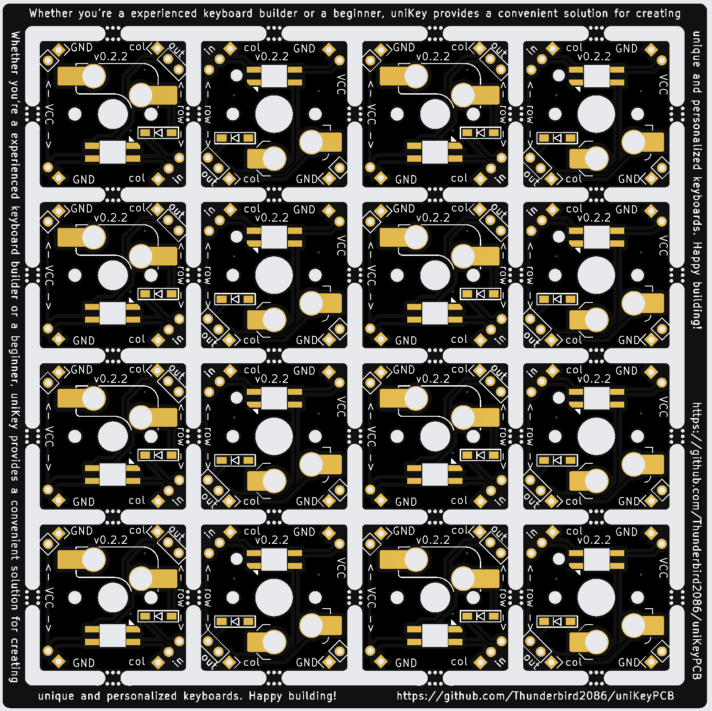

# uniKey: A Compact PCB for Single Key Switches

uniKey is a compact printed circuit board (PCB) designed specifically for single key switches. It comes in two variants: one for MX-style switches and another for Chocolate-style switches. Whether you’re a keyboard enthusiast or a DIY hobbyist, uniKey offers a versatile solution for creating custom handwired keyboards.

Features:

* Compact Design: uniKey’s small form factor makes it ideal for handwired keyboard projects.
* Switch Compatibility: Choose between MX or Chocolate switches based on your preference.
* LED Support: uniKey includes support for RGB LEDs, allowing you to add customizable lighting effects to your keyboard.
* Simplified Wiring: If you opt for pin sockets, you can easily connect each key and LED using jumper wires. Minimal soldering is necessary—only for the LED, hotswap socket, diode and pin sockets. This allows you to create a prototype keyboard for your custom case and test it without having to order revised PCBs multiple times. 
* Customization: Build your dream keyboard by combining uniKey with your favorite keycaps and switches.

Whether you’re a experienced keyboard builder or a beginner, uniKey provides a convenient solution for creating unique and personalized keyboards. Happy building! 🚀🔥

