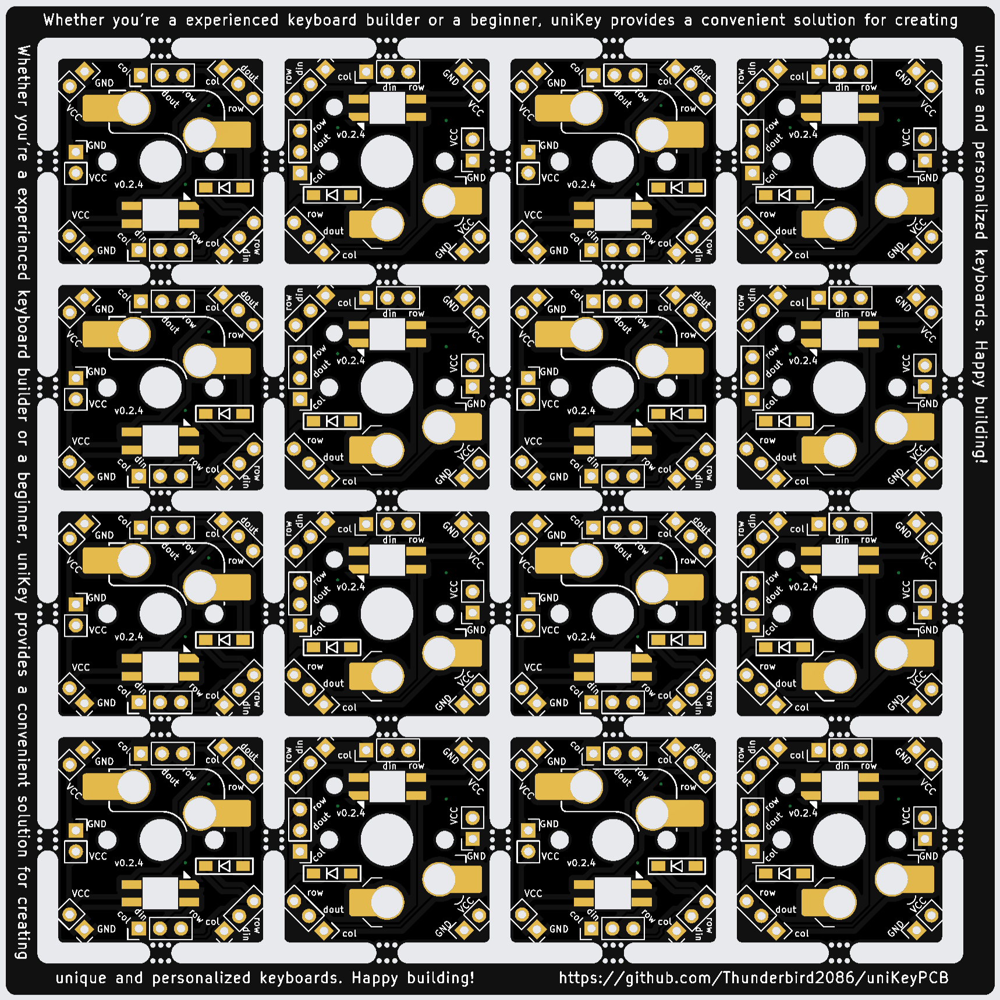

# uniKey: A Compact PCB for Single Key Switches

uniKey is a compact printed circuit board (PCB) designed specifically for single key switches. It comes in two variants: one for MX-style switches and another for Chocolate-style switches. Whether you’re a keyboard enthusiast or a DIY enthusiast, uniKey offers a versatile solution for creating custom handwired keyboards.

Features:

* Compact Design: uniKey’s small form factor makes it ideal for handwired keyboard projects.
* Switch Compatibility: Choose between MX or Chocolate switches based on your preference.
* LED Support: uniKey includes support for RGB LEDs, allowing you to add customizable lighting effects to your keyboard.
* Easy Wiring: If you use pin sockets, you can connect each key and LED using jumper wires. Minimal soldering is required—only for the LED, hotswap socket, and pin sockets.
* Customization: Build your dream keyboard by combining uniKey with your favorite keycaps and switches.

Whether you’re a seasoned keyboard builder or a beginner, uniKey provides a convenient solution for creating unique and personalized keyboards. Happy building! 🚀🔥

